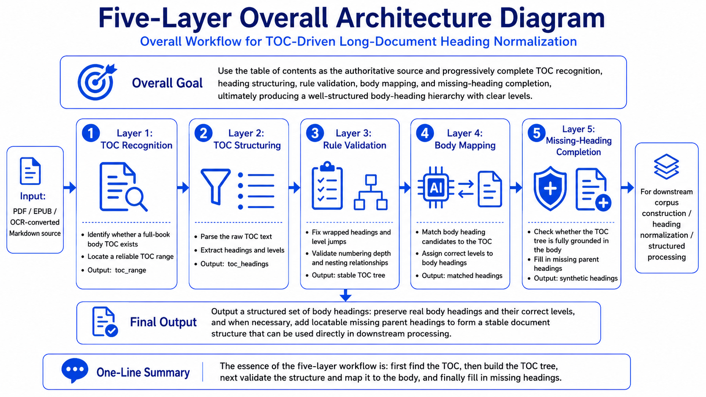
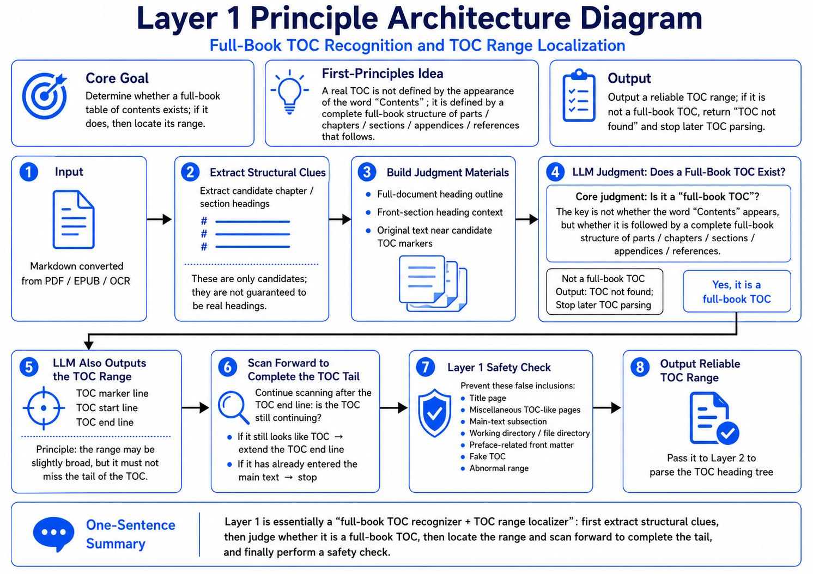
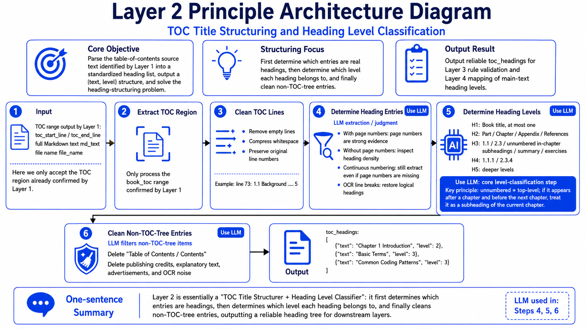
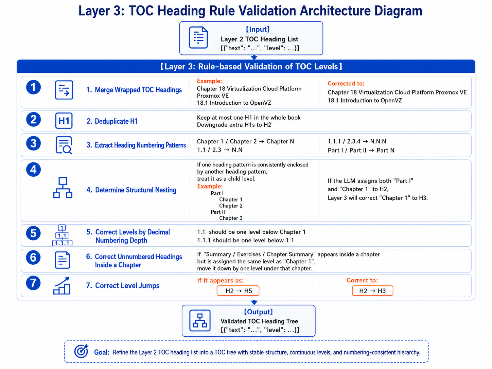
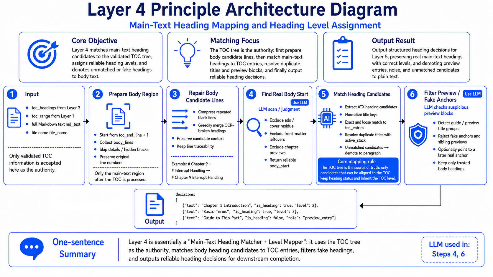
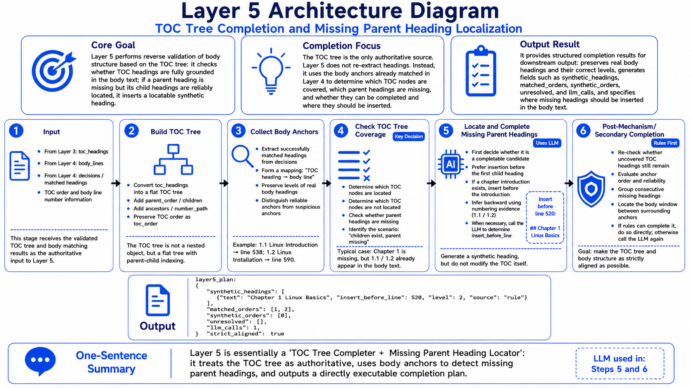

<h1 align="center">Long Document Heading Normalizer</h1>

<p align="center">
  <b>A table-of-contents-driven Markdown heading normalizer for long books</b>
</p>

<p align="center">
  = 3.8" />
  
  
</p>

This project primarily solves common heading errors that occur after converting MinerU, PDF, EPUB, or OCR outputs into Markdown: table-of-contents entries, advertisements, code blocks, OCR text from images, headers, footers, and other noise may be incorrectly marked as `#` headings, while real body headings may have incorrect levels, missing parent headings, or OCR-induced line breaks.

## ✨ I. Project Overview

**Core conclusion: this tool is suitable for converting “OCR/converted Markdown from long books” into structured Markdown whose table of contents and body headings are strictly aligned.**

The input can be a single `.md` file or a directory containing many `.md` files. Directories are scanned recursively.

The project currently uses `tools.py` as the main entry point and calls an OpenAI-compatible Chat Completions API. By default, it targets a local vLLM/Qwen service, but it can also connect to DeepSeek, OpenAI-compatible gateways, or other compatible interfaces through command-line parameters.

## 🧠 II. First Principles: Five-Layer Architecture Explanation

**Core conclusion: do not treat existing `#` symbols in the body as real headings; the true source of authority is the book’s full table of contents.**

The biggest problem with Markdown converted from PDF/OCR is not “insufficient regular expressions,” but “lack of a trustworthy structural source.” The first principle of this script is to decompose heading normalization into five verifiable layers: first locate the table of contents, then parse it, validate the table-of-contents tree, map body candidates to the table of contents, and finally use the table-of-contents tree to fill in missing but locatable parent headings in the body.

### Five-Layer Overall Architecture Diagram

<p align="center">
  
</p>

### Layer 1: Identify the Full Book Body Table of Contents and Locate Its Range

<p align="center">
  
</p>

Layer 1 does not simply search for the word “Contents” or “Table of Contents.” Instead, it determines whether a region is followed by a complete full-book structure of parts, chapters, sections, appendices, references, and similar components. It extracts raw `#` candidates from the original text, constructs table-of-contents judgment materials, and asks the LLM to determine whether a `book_toc` exists.

If the end of the table of contents is not fully covered in one pass, the script continues tail scanning afterward to recover the real end of the table of contents as much as possible. If the region is found to be only a list of figures, list of tables, body subsection, working directory, preface note, or an abnormal range, it stops subsequent table-of-contents parsing.

### Layer 2: Parse Raw Table-of-Contents Text into a Heading Tree

<p align="center">
  
</p>

Layer 2 only processes the table-of-contents region confirmed by Layer 1. It cleans the table-of-contents lines, removes empty lines, compresses whitespace, preserves hierarchical symbols, and then uses the LLM to determine which lines are real table-of-contents headings. It outputs a structured list:

```json
{
  "headings": [
    {"text": "Chapter 1 Introduction", "level": 2},
    {"text": "Basic Syntax", "level": 3}
  ]
}
```

The focus of this layer is to convert the table of contents from a “raw text region” into reliable `toc_headings`. It handles page numbers, page-number-free tables of contents, OCR line breaks, heading continuation lines, advertisements, and non-table-of-contents noise.

### Layer 3: Rule-Based Validation of Table-of-Contents Heading Levels

<p align="center">
  
</p>

Layer 3 no longer relies on subjective LLM judgment. Instead, it uses rules to correct the table-of-contents tree. Typical corrections include:

- Merging table-of-contents headings split by OCR line breaks.
- Keeping at most one H1 in the whole book, while automatically demoting extra H1 headings.
- Correcting levels according to numbering patterns such as `1.1`, `1.1.1`, `Part I`, and `Chapter 1`.
- Fixing structural nesting errors, such as “Part I” containing “Chapter 1.”
- Fixing hierarchy jumps such as H2 directly jumping to H5.

The output of this layer is a table-of-contents heading tree that is structurally stable, level-continuous, and consistent with numbering logic.

### Layer 4: Map Body Heading Candidates to Table-of-Contents Headings

<p align="center">
  
</p>

Layer 4 treats the table-of-contents tree as the only authoritative source and matches body `#` candidates against it. Only body candidates that correspond to table-of-contents entries are kept as headings and inherit the corresponding table-of-contents levels. Advertisements, cover-page residue, chapter previews, guide blocks, pseudo anchors, and unmatched headings are downgraded to ordinary body text.

This layer also uses the LLM to assist in determining the true body start and suspicious preview blocks, avoiding the mistake of treating chapter previews after the table of contents as body headings.

### Layer 5: Use the Table-of-Contents Tree to Fill Missing Parent Headings

<p align="center">
  
</p>

Layer 5 handles a common issue in long books: subheadings appear in the body, but their parent headings are not preserved by OCR or the converter. For example, the body may contain locatable `1.1` and `1.2`, while `Chapter 1` is missing.

The script builds a table-of-contents tree, collects the body anchors already matched by Layer 4, and checks which table-of-contents nodes are not covered. If a missing parent heading can be reliably located based on adjacent anchors, numbering evidence, and the body text window, the script generates `synthetic_headings` and inserts them into the body. If the anchors are unreliable or the range is too large, the script skips the current file and writes an error message to avoid inserting headings at the wrong position.

## 🎯 III. Scope of Application

**Core conclusion: this tool is best suited for long-form books with a full-book table of contents. It is especially suitable for Chinese texts, also supports English texts, and targets heading normalization for Markdown files output by MinerU.**

Suitable for:

- Long Markdown files converted from MinerU, OCR, PDF, or EPUB.
- E-books, textbooks, technical books, manuals, and paper collections with complete tables of contents and clear chapter hierarchies.
- Chinese books, especially those with table-of-contents structures such as “Chapter X,” “Section X,” `1.1`, and `1.1.1`.
- English books with structures such as `Part I`, `Chapter 1`, `1.1`, `Appendix`, and `References`.
- Batch processing of many `.md` files under a folder.

Not suitable for:

- Articles, short texts, blogs, or meeting notes without a real full-book body table of contents.
- Markdown documents that only contain a list of figures, list of tables, index, or “file directory/working directory” descriptions.
- Materials whose table of contents and body headings do not correspond at all.
- Scenarios that require preserving all preface advertisements, cover pages, headers, footers, and conversion noise.

## ⚙️ IV. Environment Setup

**Core conclusion: the CLI script itself mainly uses the Python standard library; the truly necessary dependency is an accessible OpenAI-compatible LLM interface.**

### 1. Python Version

Python 3.10 or later is recommended. The script uses syntax introduced after Python 3.8, so the minimum required version is Python 3.8.

Check the version:

```powershell
python --version
```

### 2. Install Requirements

The current `requirements.txt` only contains the Notebook debugging dependency:

```text
ipykernel>=7.2.0
```

Installation command:

```powershell
python -m pip install -r requirements.txt
```

If you only run `tools.py` from the terminal, the core logic uses the Python standard library. However, it is still recommended to run the installation command above to keep the debugging environment consistent.

### 3. Configure the API Key

The LLM processing workflow of this project currently uses the `qwen3-30b` model throughout, including table-of-contents localization, table-of-contents parsing, body heading matching, and missing parent heading completion. Actual tests have produced satisfactory results, especially for recognizing Chinese long-book table-of-contents structures and repairing heading levels.

`tools.py` currently reads the environment variable `LOCAL_LLM_API_KEY` by default. If your local interface does not validate keys, you can set it to `EMPTY`.

Configure it for the current PowerShell window:

```powershell
$env:LOCAL_LLM_API_KEY = "EMPTY"
```

Use a real key:

```powershell
$env:LOCAL_LLM_API_KEY = "sk-xxxx"
```

You can also pass it directly at runtime:

```powershell
python tools.py book.md --api-key "sk-xxxx"
```

## 💻 V. Terminal Usage

**Core conclusion: the two most commonly used commands are processing a single file, or batch processing a directory with resumable execution enabled.**

### 1. Default Single-File Processing

```powershell
python tools.py book.md
```

Default behavior:

- Input: `book.md`
- Output Markdown: `standardized_md3/book.md`
- Output JSON: `heading_json3/book.headings.json`
- Cache: enabled
- Model: `qwen3-30b`
- API endpoint: `http://brain-X99:8000/v1/chat/completions`
- API key environment variable: `LOCAL_LLM_API_KEY`

### 2. Batch Process a Directory

```powershell
python tools.py data_folder --out-dir output --json-dir heading_json --resume
```

Directory input recursively searches for all `.md` files. `--resume` skips files whose output Markdown and JSON both already exist, making it suitable for continuing a batch task after interruption.

### 3. Specify an External Compatible Interface

`--base-url` can accept a root URL, a `/v1` URL, or a complete `/chat/completions` URL. The script automatically normalizes it into a Chat Completions endpoint.

```powershell
python tools.py book.md --base-url https://api.deepseek.com --model deepseek-chat --api-key "sk-xxxx"
```

After specifying `--base-url`, if `--vllm-extra-body` is not explicitly set, the script disables the vLLM/Qwen-specific `enable_thinking` extension field by default, making it easier to connect to ordinary OpenAI-compatible services.

### 4. Specify the Environment Variable Name

```powershell
$env:MY_LLM_KEY = "sk-xxxx"
python tools.py book.md --api-key-env MY_LLM_KEY
```

### 5. Disable Cache and Rerun

```powershell
python tools.py book.md --no-cache
```

This skips the existing `.cache_batch3` cache and requests the LLM again. It is suitable when you have modified the prompt or model, or when you suspect cached results are unreliable.

### 6. Adjust Table-of-Contents Parsing Chunks

When the table of contents is very long, Layer 2 automatically sends it to the LLM in chunks. You can manually adjust the chunking parameters:

```powershell
python tools.py book.md --toc-single-max-lines 220 --toc-chunk-lines 120 --toc-chunk-max-tokens 8000
```

## 📋 VI. All Command-Line Parameters and Defaults

**Core conclusion: the parameters fall into four categories: input/output, cache/resume, LLM configuration, and table-of-contents parsing.**

Input and output:

|   Parameter   |       Default       |                Description                |
| :------------: | :------------------: | :---------------------------------------: |
|   `paths`   |       Required       | One or more `.md` files or directories. |
| `--out-dir` | `standardized_md3` | Output directory for normalized Markdown. |
| `--json-dir` |  `heading_json3`  |     Output directory for debug JSON.     |

Cache and resume:

|   Parameter   |  Default  |                        Description                        |
| :------------: | :-------: | :-------------------------------------------------------: |
| `--no-cache` | `False` |     Ignore existing cache and request the LLM again.     |
|  `--resume`  | `False` | Skip files whose Markdown and JSON outputs already exist. |

LLM configuration:

|         Parameter         | Default |                   Description                   |
| :-----------------------: | :------: | :----------------------------------------------: |
| `--base-url`, `--url` | `None` |     OpenAI-compatible endpoint for this run.     |
|        `--model`        | `None` |             Model name for this run.             |
|       `--api-key`       | `None` |   API key passed directly on the command line.   |
|     `--api-key-env`     | `None` | Environment variable used as the API key source. |
|   `--vllm-extra-body`   | `None` |      Enable the vLLM/Qwen extension field.      |
| `--no-vllm-extra-body` | `None` |      Disable the vLLM/Qwen extension field.      |

Table-of-contents parsing:

|         Parameter         | Default |                          Description                          |
| :------------------------: | :------: | :-----------------------------------------------------------: |
| `--toc-single-max-lines` | `220` | Use one Layer 2 request when the cleaned TOC is short enough. |
|   `--toc-chunk-lines`   | `120` |             Maximum cleaned TOC lines per chunk.             |
| `--toc-chunk-max-tokens` | `8000` |          Output token limit for each Layer 2 chunk.          |

Internal default configuration of the script:

|              Item              |                     Value                     |                      Description                      |
| :----------------------------: | :-------------------------------------------: | :---------------------------------------------------: |
|          `BASE_URL`          | `http://brain-X99:8000/v1/chat/completions` |          Default Chat Completions endpoint.          |
|           `MODEL`           |                 `qwen3-30b`                 |                    Default model.                    |
|        `API_KEY_ENV`        |             `LOCAL_LLM_API_KEY`             |         Default API key environment variable.         |
|    `LLM_USE_VLLM_EXTRAS`    |                   `True`                   | Sends `enable_thinking=False` to the local service. |
|       `OUTPUT_TOKENS`       |                   `2000`                   |      Regular single-request output token limit.      |
|          `TIMEOUT`          |                    `600`                    |       Regular API request timeout, in seconds.       |
|       `CACHE_VERSION`       |         `v15_book_toc_layer1_type`         |               Cache version identifier.               |
| `TOC_PARSE_SINGLE_MAX_LINES` |                    `220`                    |          Layer 2 single-batch TOC threshold.          |
|   `TOC_PARSE_CHUNK_LINES`   |                    `120`                    |                Layer 2 TOC chunk size.                |
| `TOC_PARSE_CHUNK_MAX_TOKENS` |                   `8000`                   |           Layer 2 chunk output token limit.           |

## 🧭 VII. Output and Troubleshooting

**Core conclusion: for successful files, check the Markdown; for abnormal files, check `error / stage / message` in the JSON.**

Common results:

|                Situation                |         `error` in JSON         |                                Meaning                                |
| :--------------------------------------: | :--------------------------------: | :-------------------------------------------------------------------: |
|        Input file does not exist        |          `missing_file`          |    The file may have been moved or renamed during batch execution.    |
|   No full-book body table of contents   |         `no_toc_region`         | The file is skipped because it is not suitable for TOC-driven repair. |
|      LLM returns unrecoverable JSON      |        Stage-specific error        |  The current file is skipped, and the JSON records the failed stage.  |
| Final headings cannot align with the TOC | `final_heading_alignment_failed` |  Pre-output validation failed, so no misaligned Markdown is written.  |
|             Other exceptions             |       `processing_failed`       |       Uncategorized exception; inspect `message` for details.       |

Recommended troubleshooting order:

1. Confirm that the input `.md` is UTF-8 text and truly contains a full-book body table of contents.
2. Confirm that the LLM service address is reachable and that the interface is compatible with Chat Completions.
3. Confirm that the model name, API key, and environment variable name are correct.
4. If you changed the model or prompt, rerun with `--no-cache`.
5. After a batch task is interrupted, continue unfinished files with `--resume`.

## 🚀 VIII. Recommended Workflow

**Core conclusion: first validate with a small sample, then run the batch, and finally inspect abnormal files through JSON.**

```powershell
# 1. Set the API key
$env:LOCAL_LLM_API_KEY = "EMPTY"

# 2. Explicitly specify the API endpoint and model, and first process one book to validate the output
python tools.py book.md --base-url http://brain-X99:8000 --model qwen3-30b --api-key-env LOCAL_LLM_API_KEY

# 3. Process one book using the default API configuration
python tools.py book.md

# 4. Batch process a directory with resumable execution enabled
python tools.py data_folder --out-dir markdown_output_path --json-dir intermediate_json_output_path --resume

# 5. After modifying the model or rules, skip cache and rerun if necessary
python tools.py data_folder --out-dir markdown_output_path --json-dir intermediate_json_output_path --no-cache
```

One-sentence memory aid: this project is not about “making all `#` symbols look nicer”; it is about “using the full-book table of contents as the authoritative structure and reattaching body headings to the correct table-of-contents tree.”
