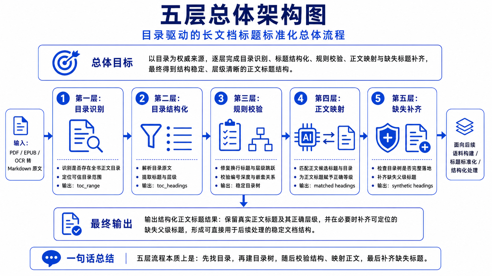
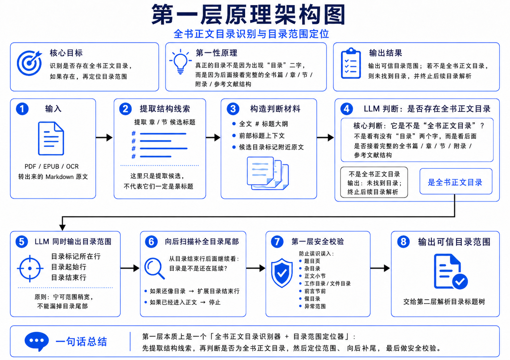
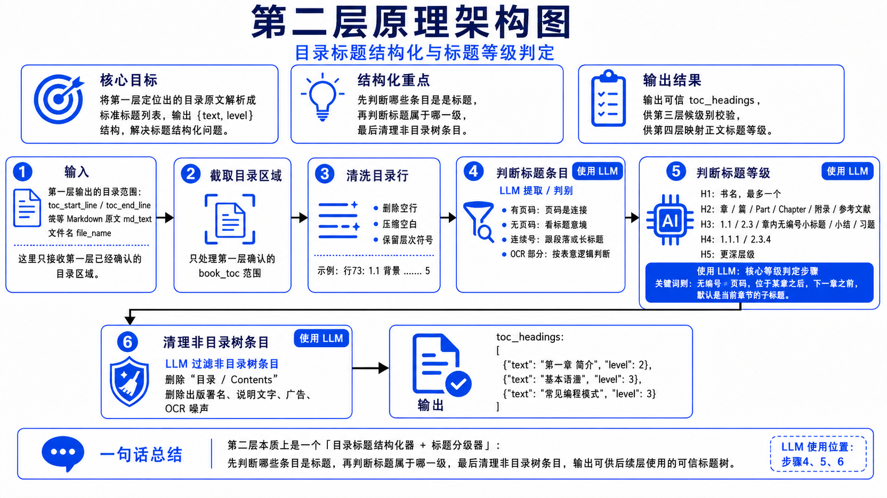
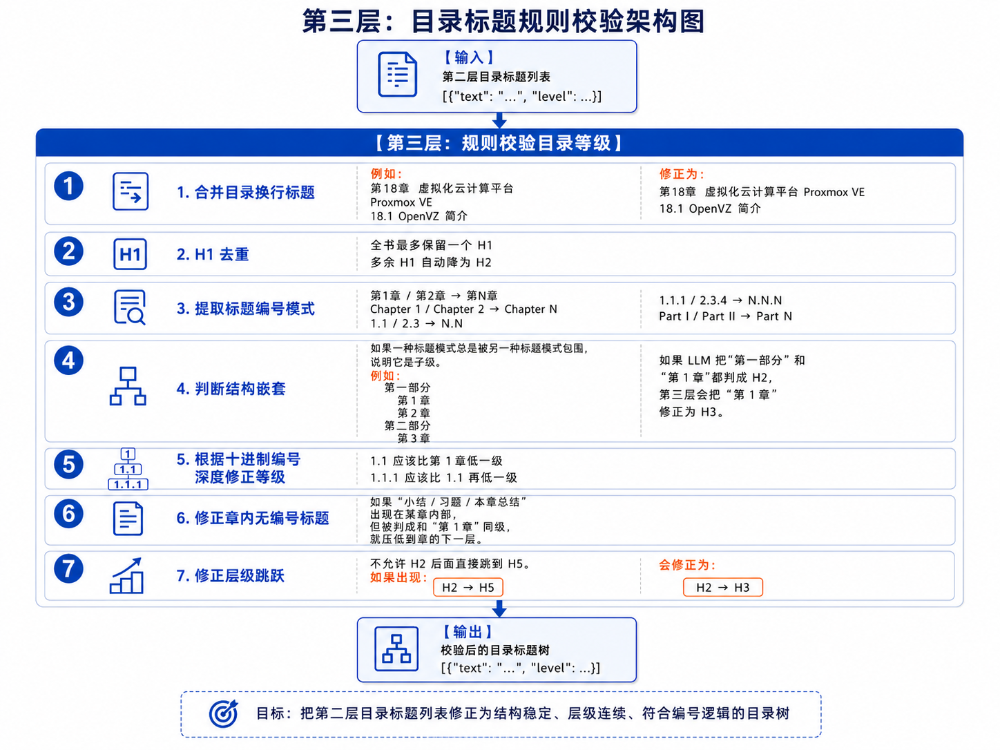
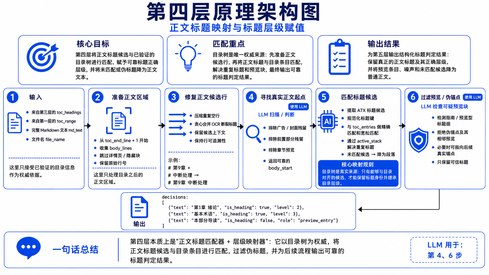
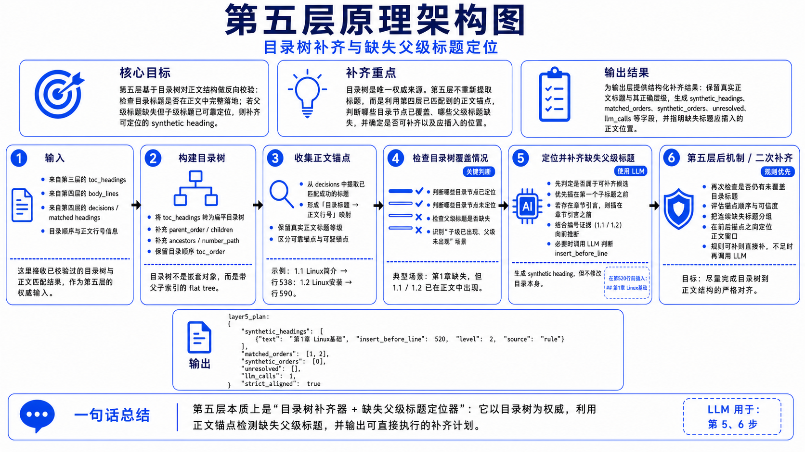

<h1 align="center">Long Document Heading Normalizer</h1>

<p align="center">
  <b>目录驱动的长书 Markdown 标题标准化工具</b>
</p>

<p align="center">
  = 3.8" />
  
  
</p>

本项目主要解决 MinerU、PDF/EPUB/OCR 转 Markdown 后常见的标题错误问题：目录条目、广告、代码块、图片 OCR 文本、页眉页脚等内容可能被错误标成 `#` 标题，而真正的正文标题又可能等级错乱、缺失父级标题或被 OCR 换行拆断。

## ✨ 一、项目概括

**本章核心结论：这个工具适合把“长书 OCR/转换 Markdown”修正成目录与正文标题严格对齐的结构化 Markdown。**

输入可以是单个 `.md` 文件，也可以是包含很多 `.md` 文件的目录。目录会被递归扫描。

处理后会生成两类结果：

|      输出      |                 默认位置                 |                           作用                           |
| :-------------: | :--------------------------------------: | :------------------------------------------------------: |
| 标准化 Markdown |     `standardized_md3/原文件名.md`     |     只保留目录和正文，正文标题使用正确 Markdown 等级     |
|    调试 JSON    | `heading_json3/原文件名.headings.json` | 保存目录范围、目录标题树、正文匹配结果、第五层补齐计划等 |
|    缓存 JSON    |   输入文件同目录下 `.cache_batch3/`   |             缓存 LLM 阶段结果，重复运行更快             |

项目当前以 `tools.py` 为核心入口，调用 OpenAI-compatible Chat Completions API。默认面向本地 vLLM/Qwen 服务，也可以通过命令行参数接入 DeepSeek、OpenAI 兼容网关或其他兼容接口。

## 🧠 二、第一性原理：五层中文架构图说明

**本章核心结论：不要把正文里已有的 `#` 当成真标题；真正的权威来源是全书目录。**

PDF/OCR 转换后的 Markdown 最大问题不是“缺少正则”，而是“缺少可信结构源”。脚本的第一性原理是把标题标准化拆成五个可校验层次：先定位目录，再解析目录，再校验目录树，再把正文候选映射到目录，最后用目录树补齐正文中缺失但可定位的父级标题。

### 五层总体架构图

<p align="center">
  
</p>

### 第一层：识别全书正文目录并定位范围

<p align="center">
  
</p>

第一层不是简单搜索“目录”两个字，而是判断某个区域后面是否接着完整的全书篇、章、节、附录、参考文献结构。它会提取原文 `#` 候选、构造目录判断材料，并让 LLM 判断是否存在 `book_toc`。

如果目录尾部没有被一次性覆盖，脚本会继续向后做 tail 扫描，尽量补全真实目录尾部；如果发现只是图目录、表目录、正文小节、工作目录、前言说明或异常范围，则停止后续目录解析。

### 第二层：把目录原文解析成标题树

<p align="center">
  
</p>

第二层只处理第一层确认后的目录区域。它会清洗目录行，删除空行、压缩空白、保留层次符号，再用 LLM 判断哪些行是真正目录标题，并输出结构化列表：

```json
{
  "headings": [
    {"text": "第一章 简介", "level": 2},
    {"text": "基本语法", "level": 3}
  ]
}
```

这一层的重点是把目录从“原始文本区域”变成可靠的 `toc_headings`。它会处理页码、无页码目录、OCR 换行、标题续行、广告和非目录噪声。

### 第三层：规则校验目录等级

<p align="center">
  
</p>

第三层不再依赖 LLM 主观判断，而是用规则修正目录树。典型修正包括：

- 合并被 OCR 换行拆开的目录标题。
- 全书最多保留一个 H1，多余 H1 自动降级。
- 根据 `1.1`、`1.1.1`、`Part I`、`Chapter 1` 等编号模式修正等级。
- 修复结构嵌套错误，例如“第一部分”包住“第 1 章”。
- 修正 H2 直接跳到 H5 这类层级跳跃。

这一层输出的是结构稳定、层级连续、符合编号逻辑的目录标题树。

### 第四层：把正文标题候选映射到目录标题

<p align="center">
  
</p>

第四层把目录树当作唯一权威来源，对正文 `#` 候选进行匹配。正文里只有能和目录条目对应上的候选，才会被保留为标题并继承目录等级；广告、封面残留、章节预告、导读块、伪锚点、未匹配标题会被降为普通正文。

这一层还会用 LLM 辅助判断真正正文起点和可疑预览块，避免把目录之后的章节预告误当作正文标题。

### 第五层：用目录树补齐缺失父级标题

<p align="center">
  
</p>

第五层处理一种长书中很常见的问题：正文里出现了子标题，但父级标题没有被 OCR 或转换器保留下来。例如正文中能定位到 `1.1`、`1.2`，但 `第 1 章` 缺失。

脚本会构建目录树，收集第四层已经匹配到的正文锚点，检查哪些目录节点未覆盖。如果缺失父级可以根据相邻锚点、编号证据和正文窗口可靠定位，就生成 `synthetic_headings` 补齐到正文中；如果锚点不可靠或范围过大，则跳过当前文件并写出错误信息，避免硬补错位置。

## 🎯 三、适用范围

**本章核心结论：最适合“有全书目录的长文本书籍”，中文尤其合适，英文也可用，面向 mieru 输出的 md 文件进行标题标准化。**

适合：

- MinerU、OCR、PDF/EPUB 转出来的长篇 Markdown。
- 有完整目录、章节层级明显的电子书、教材、技术书、手册、论文集。
- 中文书籍，尤其是带“第 X 章 / 第 X 节 / 1.1 / 1.1.1”的目录结构。
- 英文书籍，例如 `Part I`、`Chapter 1`、`1.1`、`Appendix`、`References` 等结构。
- 批量处理一个文件夹下的大量 `.md` 文件。

不适合：

- 没有真实全书正文目录的文章、短文、博客、会议记录。
- 只有图目录、表目录、索引或“文件目录/工作目录”说明的 Markdown。
- 目录和正文标题完全不对应的材料。
- 需要保留所有前言广告、封面页、页眉页脚和转换噪声的场景。

## ⚙️ 四、环境安装

**本章核心结论：CLI 脚本本身基本只用 Python 标准库，真正必需的是一个可访问的 OpenAI-compatible LLM 接口。**

### 1. Python 版本

建议使用 Python 3.10 及以上；脚本使用了 Python 3.8 之后才有的语法，因此最低需要 Python 3.8。

检查版本：

```powershell
python --version
```

### 2. 安装 requirements

当前 `requirements.txt` 只有 Notebook 调试依赖：

```text
ipykernel>=7.2.0
```

安装命令：

```powershell
python -m pip install -r requirements.txt
```

如果只在终端运行 `tools.py`，核心逻辑使用的是 Python 标准库；但仍建议执行上面的安装命令，保证调试环境一致。

### 3. 配置 API Key

本项目的 LLM 处理流程目前全部使用 `qwen3-30b` 模型完成，包括目录定位、目录解析、正文标题匹配和缺失父级标题补齐。实际测试效果比较满意，尤其适合中文长书目录结构识别和标题层级修复。

`tools.py` 当前默认读取环境变量 `LOCAL_LLM_API_KEY`。如果你的本地接口不校验 key，可以设为 `EMPTY`。

PowerShell 当前窗口配置：

```powershell
$env:LOCAL_LLM_API_KEY = "EMPTY"
```

使用真实 key：

```powershell
$env:LOCAL_LLM_API_KEY = "sk-xxxx"
```

也可以运行时直接传入：

```powershell
python tools.py book.md --api-key "sk-xxxx"
```

## 💻 五、终端使用方法

**本章核心结论：最常用的命令只有两个：处理单文件，或批量处理目录并开启断点续跑。**

### 1. 默认单文件处理

```powershell
python tools.py book.md
```

默认行为：

- 输入：`book.md`
- 输出 Markdown：`standardized_md3/book.md`
- 输出 JSON：`heading_json3/book.headings.json`
- 使用缓存：开启
- 模型：`qwen3-30b`
- API 地址：`http://brain-X99:8000/v1/chat/completions`
- API key 环境变量：`LOCAL_LLM_API_KEY`

### 2. 批量处理目录

```powershell
python tools.py data_folder --out-dir output --json-dir heading_json --resume
```

目录输入会递归查找所有 `.md` 文件。`--resume` 会跳过已经同时存在输出 Markdown 和 JSON 的文件，适合批量任务中断后继续跑。

### 3. 指定外部兼容接口

`--base-url` 可以传根地址、`/v1` 地址，或完整 `/chat/completions` 地址。脚本会自动规范化为 Chat Completions 端点。

```powershell
python tools.py book.md --base-url https://api.deepseek.com --model deepseek-chat --api-key "sk-xxxx"
```

指定 `--base-url` 后，如果没有显式设置 `--vllm-extra-body`，脚本会默认关闭 vLLM/Qwen 专用的 `enable_thinking` 扩展字段，方便连接普通 OpenAI-compatible 服务。

### 4. 指定环境变量名

```powershell
$env:MY_LLM_KEY = "sk-xxxx"
python tools.py book.md --api-key-env MY_LLM_KEY
```

### 5. 关闭缓存重新跑

```powershell
python tools.py book.md --no-cache
```

这会跳过已有 `.cache_batch3` 缓存，重新请求 LLM。适合修改 prompt、模型或怀疑缓存结果不可靠时使用。

### 6. 调整目录解析分块

目录很长时，第二层会自动分块发送给 LLM。可以手动调节：

```powershell
python tools.py book.md --toc-single-max-lines 220 --toc-chunk-lines 120 --toc-chunk-max-tokens 8000
```

## 📋 六、全部命令行参数与默认值

**本章核心结论：参数分为输入输出、缓存续跑、LLM 配置、目录解析四类。**

|            参数            |        默认值        |                         说明                         |
| :------------------------: | :------------------: | :---------------------------------------------------: |
|         `paths`         |         必填         | 一个或多个输入路径；可以是 `.md` 文件，也可以是目录 |
|       `--out-dir`       | `standardized_md3` |               标准化 Markdown 输出目录               |
|       `--json-dir`       |  `heading_json3`  |                  调试 JSON 输出目录                  |
|       `--no-cache`       |      `False`      |              关闭缓存，强制重新请求 LLM              |
|        `--resume`        |      `False`      |    若输出 Markdown 和 JSON 都已存在，则跳过该文件    |
| `--base-url`, `--url` |       `None`       |         本次运行使用的 OpenAI-compatible 地址         |
|        `--model`        |       `None`       |      本次运行使用的模型名；不传则用脚本默认模型      |
|       `--api-key`       |       `None`       |              本次运行直接使用的 API key              |
|     `--api-key-env`     |       `None`       |           指定读取哪个环境变量作为 API key           |
|   `--vllm-extra-body`   |       `None`       |              显式开启 vLLM/Qwen 扩展字段              |
|  `--no-vllm-extra-body`  |       `None`       |              显式关闭 vLLM/Qwen 扩展字段              |
| `--toc-single-max-lines` |       `220`       |   第二层目录清洗后行数不超过该值时，单批发送给 LLM   |
|   `--toc-chunk-lines`   |       `120`       |     目录分块模式下，每批最多发送的清洗后目录行数     |
| `--toc-chunk-max-tokens` |       `8000`       |            第二层每批 LLM 输出 token 上限            |

脚本内部默认配置：

|             配置项             |                    当前值                    |                       说明                       |
| :----------------------------: | :-------------------------------------------: | :-----------------------------------------------: |
|          `BASE_URL`          | `http://brain-X99:8000/v1/chat/completions` |            默认 Chat Completions 地址            |
|           `MODEL`           |                 `qwen3-30b`                 |                     默认模型                     |
|        `API_KEY_ENV`        |             `LOCAL_LLM_API_KEY`             |              默认 API key 环境变量名              |
|    `LLM_USE_VLLM_EXTRAS`    |                   `True`                   | 默认向本地服务发送 `enable_thinking=False` 扩展 |
|       `OUTPUT_TOKENS`       |                   `2000`                   |            常规 LLM 单次最大输出 token            |
|          `TIMEOUT`          |                    `600`                    |           常规 API 请求超时时间，单位秒           |
|       `CACHE_VERSION`       |         `v15_book_toc_layer1_type`         |                   缓存版本标识                   |
| `TOC_PARSE_SINGLE_MAX_LINES` |                    `220`                    |              第二层单批目录行数阈值              |
|   `TOC_PARSE_CHUNK_LINES`   |                    `120`                    |                第二层目录分块行数                |
| `TOC_PARSE_CHUNK_MAX_TOKENS` |                   `8000`                   |             第二层分块输出 token 上限             |

## 🧭 七、输出与排错

**本章核心结论：成功文件看 Markdown，异常文件看 JSON 的 `error / stage / message`。**

常见结果：

|            情况            |        JSON 中的 `error`        |                   含义                   |
| :------------------------: | :--------------------------------: | :--------------------------------------: |
|       输入文件不存在       |          `missing_file`          |    批量运行期间文件可能被移动或重命名    |
|      没有全书正文目录      |         `no_toc_region`         | 文件不适合目录驱动修复，脚本跳过后续解析 |
|  LLM 返回无法修复的 JSON  |            对应阶段错误            |     当前文件跳过，JSON 保存失败阶段     |
| 最终标题无法和目录严格对齐 | `final_heading_alignment_failed` |  输出前校验失败，避免写出错位 Markdown  |
|          其他异常          |       `processing_failed`       |    未归类异常，查看 `message` 定位    |

推荐排查顺序：

1. 确认输入 `.md` 是 UTF-8 文本，并且确实包含全书正文目录。
2. 确认 LLM 服务地址可访问，接口兼容 Chat Completions。
3. 确认模型名、API key、环境变量名正确。
4. 如果换了模型或 prompt，使用 `--no-cache` 重新跑。
5. 批量任务中断后，使用 `--resume` 继续处理未完成文件。

## 🚀 八、推荐工作流

**本章核心结论：先小样本验证，再批量跑，最后用 JSON 检查异常文件。**

```powershell
# 1. 设置 API key
$env:LOCAL_LLM_API_KEY = "EMPTY"

# 2. 显式指定 API 地址和模型，先处理一本书验证输出
python tools.py book.md --base-url http://brain-X99:8000 --model qwen3-30b --api-key-env LOCAL_LLM_API_KEY

# 3. 使用默认 API 配置处理一本书
python tools.py book.md

# 4. 批量处理目录，开启断点续跑
python tools.py data_folder --out-dir md文件地址 --json-dir 中间json文件地址 --resume

# 5. 修改模型或规则后，必要时跳过缓存重跑
python tools.py data_folder --out-dir md文件地址 --json-dir 中间json文件地址 --no-cache
```
